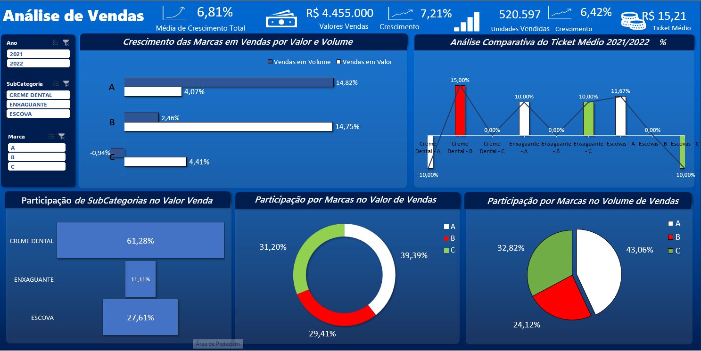

# Processo Seletivo
Esse foi um dos projetos mais interessantes e também um dos melhores processos seletivos nos quais participei. Foi uma experiência muito importante para minha carreira, e estou ansioso para compartilhar com você como ele foi desenvolvido e como eu respondi a ele. Infelizmente, não tenho conseguido atualizar meu portfólio com tanta frequência ultimamente, devido à minha carga de trabalho como freelancer. Assim que puder, pretendo compartilhar tudo sobre o que tenho feito e como tenho feito uma diferença significativa na empresa em que estou trabalhando, mesmo sendo apenas um freelancer. Não pude incluir tantos detalhes e caprichos como costumo fazer em projetos anteriores, pois tenho me dedicado mais a projetos reais. No entanto, gosto de trazer novidades sempre que possível. Prometo postar algo diferente sempre que tiver a oportunidade!

## Link do Projeto.

  
<a href="https://github.com/felipefagion/projeto_excel/blob/main/dashboardexcel.ipynb" target="_blank">
